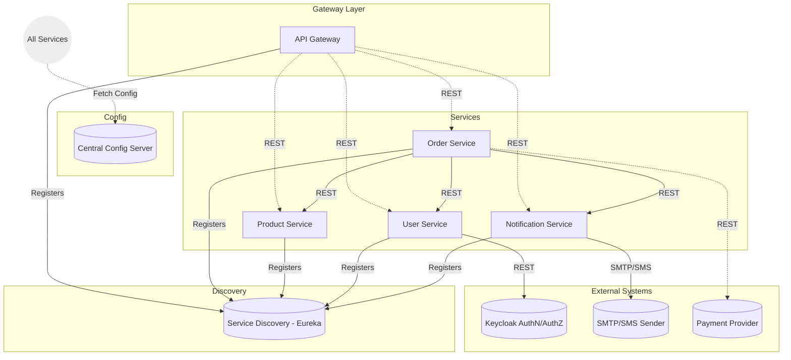

# 🛍️ E-Commerce Microservices Platform

A cloud‑ready, scalable **eCommerce backend** built using **Spring Boot**, **Spring Cloud**, **Microservices Architecture**, and **Docker**. This project demonstrates real‑world distributed system design, API gateway routing, centralized configuration, and independent service deployments.

---

## 🚀 Overview

This project follows a production-style microservices architecture with multiple independent backend services:

- **Product Service**
- **User Service**
- **Authentication Service**
- **Cart Service**
- **Order Service**
- **Inventory Service**
- **API Gateway**
- **Service Registry (Eureka)**
- **Config Server**
- **Notification Service (optional)**

Each service is **independently deployable**, **scalable**, and fully **containerized** using Docker.

---

## 🧱 Architecture Diagram
# E-Commerce Microservices Architecture


## Details

- **API Gateway**: Entry point for all client requests, routes external traffic to services.
- **Eureka Service Discovery**: Enables services and API Gateway to dynamically find each other.
- **Config Server**: Central repository of configuration, fetched by all microservices at startup.
- **Order, Product, User, Notification Services**: Core Business Services, each with its own database.
    - All communications between services use REST (usually via Spring Feign/RestTemplate/WebClient).
    - Services register with Eureka for discovery.
- **External Integrations:**
    - **Keycloak** (SSO/Auth): User Service syncs & authenticates with Keycloak for authentication and RBAC.
    - **Payment Gateway**: Order Service calls external payment providers over REST.
    - **Email/SMS (Notification Service)**: Dispatches event-driven notifications via standard mail/SMS protocols.

## 🛠️ Tech Stack

- **Spring Boot**, **Spring Cloud**
- **Spring Security**, **JWT**
- **Docker / Buildpacks**
- **PostgreSQL / MySQL**  
- **Maven**

---

## ▶️ Running the Project

### Clone the project
```bash
git clone https://github.com/mayuri5401/<your-repo>.git
cd <your-repo>
            
